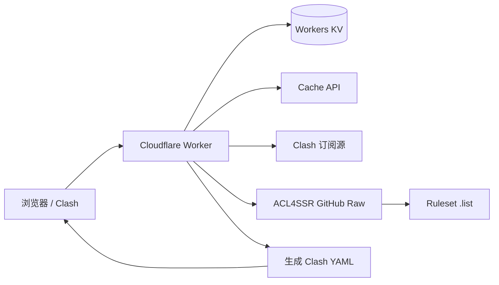

# fgfwsub Worker：原型与技术方案（v0.1）

## 1. 目标与范围

在一个 Cloudflare Worker 中完成以下 MVP：

- 管理员通过 `/<admin-key>` 维护多个 Clash 订阅地址。
- 每个订阅地址可带 URL fragment 标签，例如 `https://example.com/sub#HK_PRIVATE`；fragment 不发送给上游，仅用于本地标记该订阅产生的所有节点。
- 聚合多个 Clash YAML，过滤“流量、到期、套餐”等信息节点，去重并生成一份 Clash YAML。
- `proxy-groups` 与 `rules` 由环境变量 `ACC4SSR_INI` 指定的 ACL4SSR INI 配置生成。
- 管理员输出包含所有节点；`/<user-key>` 输出排除带精确标签 `PRIVATE` 的节点。
- 根据 User-Agent 自动返回 Clash；同时提供 `?format=clash` 作为可测试、可预期的显式覆盖。

本阶段不支持节点测速、账号体系、多租户、在线编辑 ACL4SSR INI 和非 Clash 输出。多协议 URI 订阅及本地上传作为 v0.2 扩展，方案见 [protocol-input-design.md](./protocol-input-design.md)。

## 2. 页面原型

### 管理员视图 `/<admin-key>`

1. 顶栏显示“订阅聚合”、当前身份和“复制订阅地址”。
2. 订阅编辑器每行包含：启用开关、订阅 URL、解析出的标签、删除按钮。
3. 支持新增一行、保存配置、刷新预览。
4. 管理员预览区可显示完整文件正文、协议链接、节点密码、UUID 和解析后的站点字段，并允许直接编辑；该能力仅存在于通过 `ADMIN_KEY` 鉴权的管理路由。
5. 保存后显示配置版本与更新时间；错误精确落到对应订阅行。

### 只读订阅端点 `/<user-key>`

- 不提供 HTML 页面、状态页、编辑器或其他展示内容。
- 无论浏览器或客户端 User-Agent，均直接返回过滤了 `PRIVATE` 节点的 `clash.yml`。
- 成功响应使用 YAML Content-Type，并通过 `Content-Disposition` 指定文件名 `clash.yml`。

### 关键交互

```text
打开 admin-key → 加载配置 → 编辑订阅 → 校验 URL/tag → 保存 → 刷新预览
                                                             ↓
Clash 请求 admin-key → 拉取/缓存上游 → 解析/过滤 → 应用 ACL → 返回完整 YAML
Clash 请求 user-key  → 拉取/缓存上游 → 解析/过滤 → 去掉 PRIVATE → 返回公开 YAML
```

## 3. 路由与接口

| 方法 | 路径 | 权限 | 行为 |
|---|---|---|---|
| `GET` | `/<admin-key>` | 管理员 | 浏览器返回管理页；Clash UA 或 `?format=clash` 返回完整订阅 |
| `GET` | `/<user-key>` | 只读 | 始终直接返回排除 `PRIVATE` 节点的 `clash.yml`，不返回 HTML |
| `GET` | `/<admin-key>/api/config` | 管理员 | 返回完整配置与版本，包括 file 正文和 protocol_url 原文 |
| `PUT` | `/<admin-key>/api/config` | 管理员 | 校验并保存订阅源，递增版本 |
| `POST` | `/<admin-key>/api/preview` | 管理员 | 强制生成一次预览，返回统计和逐源错误 |
| `GET` | `/<admin-key>/api/status` | 管理员 | 返回完整来源、站点与节点信息 |
| `GET` | `/<admin-key>/api/subscription-qr.svg` | 管理员 | 返回当前域名用户订阅地址的 SVG 二维码 |

说明：第一版不使用 Cookie 和登录会话，key 本身就是 bearer secret。API 路由位于 key 路径之下，且所有管理响应使用 `Cache-Control: no-store`。未知路径统一返回 404，不暴露哪个 key 有效。

## 4. 数据模型

使用一个 Workers KV namespace：`CONFIG_KV`。

```ts
interface AppConfig {
  version: number;
  updatedAt: string;
  sources: Array<{
    id: string;
    type: "url" | "file" | "protocol_url";
    url?: string;      // type=url，去掉 fragment 后的 HTTPS URL
    fileName?: string; // type=file
    content?: string;  // type=file，上传的 UTF-8 原文
    protocolUrl?: string; // type=protocol_url，协议链接原文
    tags: string[];    // 统一转为大写，去重
    enabled: boolean;
  }>;
}

interface TaggedProxy {
  sourceId: string;
  tags: string[];
  proxy: Record<string, unknown>;
}
```

KV 只保存 Clash 订阅配置，当前仅使用一个 key：

- `config:current`：当前 `AppConfig`，包括 `url`、`file`、`protocol_url` 三种来源；上传文件正文和协议链接原文也保存在此 value 中。

以下运行配置全部通过 Worker 环境绑定注入，不保存到 KV：

- `ADMIN_KEY`：管理员访问 key。
- `USER_KEY`：只读用户访问 key。
- `ACC4SSR_INI`：ACL4SSR INI 文件的 HTTPS 地址。

其中 `ADMIN_KEY`、`USER_KEY` 属于敏感信息，生产环境使用 Worker secrets；`ACC4SSR_INI` 可使用普通环境变量，若其中可能包含私有仓库凭据，也应使用 secret。两个访问 key 必须不同，建议各自至少 32 字节随机值。

KV 中禁止写入访问 key、ACL 配置/解析结果、远程订阅响应缓存或生成后的 YAML。根据 v0.2 的确认需求，`file` 和 `protocol_url` 原文可能包含节点认证信息并保存在 `config:current`；通过 `ADMIN_KEY` 鉴权的管理 API 可完整返回和编辑这些内容，但不得在运行日志中记录原文。

## 5. 生成流水线

### 5.1 订阅源解析

1. 配置保存时用 `new URL()` 解析；仅允许 `https:`。
2. 读取 fragment，按 `_` 分隔，trim、转大写并去重；随后从上游 URL 中移除 fragment。
3. 生成时并发拉取启用源，但并发上限设为 4，以低于 Worker 同时等待外连的上限。
4. 限制单源响应体（建议 2 MiB）、总节点数（建议 2,000）和超时（建议 8 秒）。
5. v0.1 只接受 Clash YAML；v0.2 将使用统一入口识别 Clash YAML、Base64 URI 列表和纯文本 URI 列表，格式错误仍作为逐源错误处理，不让单个坏源拖垮全部结果。

### 5.2 无效节点过滤

节点先做结构校验，再做名称过滤。默认大小写不敏感关键词：

```text
剩余 流量 到期 过期 套餐 官网 维护 expire traffic quota reset
```

过滤条件是“名称命中信息关键词，且缺少对应协议的必要连接字段”，避免误删真正节点。管理员页面显示每个来源的原始数、有效数和过滤数，便于校准规则。

### 5.3 去重与重名

- 身份指纹：协议 + server + port + 认证主键（密码/UUID 的 SHA-256），只在内存中计算，不记录明文。
- 完全重复只保留首次出现项，并合并 tags。
- 去重并合并 tags 后，把 tags 按稳定顺序追加到节点名称，例如 `Node [TAISHAN] [LLG]`。该步骤发生在 ACL 分组匹配之前，因此普通 ACC4SSR 名称正则可以直接匹配来源 tag。
- 不同节点同名时按 `名称 · 2`、`名称 · 3` 重命名，保证 Clash 引用唯一。

### 5.4 PRIVATE 可见性

- admin：保留全部节点。
- user：在生成分组前，删除 `tags` 中包含精确值 `PRIVATE` 的节点。
- `PRIVATE-HK` 不等于 `PRIVATE`；若要同时私有，应写成 `#PRIVATE_HK`。
- 过滤必须发生在 proxy-group 计算前，确保公开配置的任何分组都不会残留私有节点名。

### 5.5 ACL4SSR 转换

解析指定 INI 的 `[custom]`：

- `ruleset=<group>,<url>`：拉取 `.list`，为每条规则追加目标 group；`[]GEOIP,CN` 转为 `GEOIP,CN,<group>`，`[]FINAL` 转为 `MATCH,<group>`。
- `custom_proxy_group=<name>`...：生成 Clash `proxy-groups`，支持 `select`、`url-test`、`fallback`、`load-balance`；正则匹配节点名，`[]组名`/`[]DIRECT`/`[]REJECT` 作为显式成员。
- `clash_rule_base` 在本项目中不远程执行或整体套用；仅使用需求给定的固定基础模板，避免上游模板覆盖安全设置。

为满足 tag 筛选，增加一个明确且向后兼容的本地扩展：

```ini
custom_proxy_group=🔒 私有节点`select`!!TAG=PRIVATE
custom_proxy_group=香港工作`select`(香港|HK)`!!TAG=WORK
```

语义：正则与 `!!TAG=` 同时存在时取交集；多个 `!!TAG=A,B` 值取 OR。tag 精确匹配、忽略大小写。若公开视图中筛选结果为空，该组会被移除，同时删除对它的无效引用并报告 warning。

节点名称匹配同时支持反向选择和 `&&` 并列条件：

```ini
; 原有行为：选择名称匹配 TAISHAN 的节点
custom_proxy_group=自动选择`url-test`(TAISHAN)`http://www.gstatic.com/generate_204`300,,50

; 反向选择：选择名称不匹配 TAISHAN 的节点
custom_proxy_group=自动选择`url-test`!TAISHAN`http://www.gstatic.com/generate_204`300,,50

; 并列反向条件：名称既不匹配 TAISHAN，也不匹配 LLG
custom_proxy_group=自动选择`url-test`!TAISHAN&&!LLG`http://www.gstatic.com/generate_204`300,,50
```

匹配规则：

- 普通表达式继续按照正则匹配节点名称，保持 ACL4SSR 现有配置兼容。
- `!<表达式>` 表示对该正则匹配结果取反。
- `&&` 表示逻辑 AND；`!TAISHAN&&!LLG` 等价于“不匹配 TAISHAN 且不匹配 LLG”。
- 同时允许正向和反向条件，例如 `HK&&!VIP` 表示名称匹配 `HK` 且不匹配 `VIP`。
- 匹配默认区分大小写，与 JavaScript 正则默认行为一致。非法正则会使当前分组生成失败，并在预览中返回明确错误，不静默回退。
- 生成顺序为：先应用 admin/user 的 `PRIVATE` 可见性边界，再把 tags 追加到节点名称，然后对剩余节点计算名称表达式，最后与 `!!TAG=` 条件取交集。

### 5.6 YAML 输出

按固定顺序输出，降低配置 diff：基础字段 → `proxies` → `proxy-groups` → `rules`。响应头建议：

```text
Content-Type: text/yaml; charset=utf-8
Content-Disposition: attachment; filename="clash.yml"
Subscription-Userinfo: （仅当能安全汇总且语义可靠时提供）
ETag: "<visibility>-<config-version>-<content-hash>"
Cache-Control: private, max-age=60
X-Fgfwsub-Partial: 1（仅部分订阅源成功时提供）
```

部分成功时，响应仍为可正常导入的 Clash YAML。响应头只暴露失败源数量等非敏感状态；具体失败源及原因仅显示在管理员预览和脱敏日志中。

## 6. Cloudflare 架构选择



选择单 Worker + KV，而不是 D1 / Durable Objects：配置体积小、写入极少、读多写少，KV 的最终一致性可接受。Cache API 用于短期缓存上游响应与生成结果；缓存丢失只影响性能，不影响正确性。

建议缓存层次：

- 上游订阅和 ACL 文件：Cache API 中保存 5 分钟 fresh + 30 分钟 stale-if-error；不写 KV。
- 最终 admin/user YAML：按配置版本和可见性分别缓存 60 秒。
- 配置保存后递增 version，因此无需全局枚举并删除旧缓存。

Cache API 是尽力而为的边缘缓存，不承担持久化职责。单个 Clash 订阅源缓存未命中且请求失败时跳过该源，继续使用其他成功源；所有启用订阅源都失败且没有任何可用节点时才返回 502。ACL4SSR INI 或必要 ruleset 获取失败时优先使用 Cache API 中最近成功结果，无缓存时返回 502，避免生成路由规则不完整的配置。

## 7. 限制、容量与套餐建议

Cloudflare Workers Free 当前每次请求最多 50 个 subrequests、最多 6 个同时等待的外连，CPU 10 ms；Paid 为更高 subrequest 上限和默认 30 秒 CPU（可配置更高）。因此：

- Free 版建议最多 10 个订阅源、ACL ruleset 最多约 30 个，并严格限制并发与响应体。
- YAML 解析、去重和数千节点序列化可能超过 Free 的 10 ms CPU；生产环境优先 Workers Paid，或在实测后把节点上限进一步降到 500–1,000。
- KV Free 每日 100,000 读、1,000 写，单 value 最大 25 MiB；本项目配置写入量很低，足够使用。

## 8. 安全设计

- `ADMIN_KEY`、`USER_KEY` 只从 secrets 读取，比较时使用固定长度摘要后再 constant-time compare；`ACC4SSR_INI` 只从环境绑定读取。
- 日志禁止记录完整 URL、fragment、订阅响应、节点认证字段和访问 key；只记录 sourceId、耗时、状态码、数量。
- 订阅 URL 只允许 HTTPS；拒绝 localhost、`.local`、私网/链路本地 IP 字面量，重定向逐跳复验并限制 3 次。管理员仍应只配置可信来源。
- 管理 API 限制 JSON body 大小和来源数量；前端渲染一律使用 `textContent`，防止节点名造成 XSS。
- 不开放 CORS；管理页设置 `frame-ancestors 'none'`、严格 CSP、`Referrer-Policy: no-referrer`。
- 单个 Clash 订阅源失败时，优先使用 Cache API 中该源最近成功的临时结果；没有缓存则跳过该源，继续聚合其他成功源，并通过响应头、管理员预览和脱敏日志报告 warning。
- 只有所有启用订阅源都失败且没有任何可用缓存，或 ACL4SSR 必要配置无法取得时，才返回 502。

## 9. 代码结构建议

```text
src/
  index.ts                 路由与响应协商
  auth.ts                  key 摘要比较、角色判断
  config.ts                KV 中 Clash 订阅配置的读写与校验
  upstream.ts              安全 fetch、超时、大小限制、缓存
  clash/parse.ts            Clash YAML 输入
  clash/filter.ts           信息节点过滤、去重、PRIVATE
  clash/render.ts           固定模板与 YAML 输出
  acl/parse-ini.ts          ruleset / custom_proxy_group 解析
  acl/compile.ts            分组与规则生成、TAG 扩展
  ui/admin.ts               管理页
test/
  fixtures/                 脱敏后的订阅与 ACL 样例
  unit/                     parser/filter/compiler
  integration/              Worker 路由、KV、缓存、故障降级
```

建议依赖：`yaml`（解析和安全序列化）；ACL INI 使用项目内小型行解析器，不引入通用 INI 包，因为反引号分隔语法并不是标准 INI。

## 10. 测试与验收

- tag：空 fragment、重复 tag、大小写、`#PRIVATE_HK`、编码字符。
- 解析：合法 Clash、无 `proxies`、超大响应、上游超时、部分源失败。
- 过滤：信息节点被删除，名称中偶然含“流量”但协议字段完整的真实节点保留。
- 权限：admin 包含 PRIVATE；user 的 proxies、所有 proxy-groups 均无 PRIVATE 引用。
- ACL：远程 ruleset、GEOIP、FINAL、普通分组正则、`!TAISHAN`、`!TAISHAN&&!LLG`、`HK&&!VIP`、名称表达式与 `!!TAG=` 组合、非法正则、空分组、循环分组引用。
- 输出：YAML 可重新解析、节点名唯一、规则目标组全部存在、ETag 稳定。
- 安全：错误日志无 key/URL credential/UUID；恶意节点名不会注入管理页 HTML。

MVP 验收口径：通过环境绑定提供 `ADMIN_KEY`、`USER_KEY`、`ACC4SSR_INI`，在 KV 配置 3 个真实 Clash 源，其中一个标记 `PRIVATE`；保存后管理员与公开订阅均能被 Clash 导入，公开订阅完全不含私有节点；ACL4SSR 分组和规则有效；其中 1 个订阅源失败且无缓存时，仍使用另外 2 个源生成可导入的 Clash YAML，并标记为部分成功；所有源均不可用且无缓存时返回 502。

## 11. 实施顺序

详细、逐阶段且带验证目标的执行计划见 [development-plan.md](./development-plan.md)。

1. 配置模型、鉴权、KV binding 和路由。
2. Clash YAML 解析、过滤、tag、去重和基础模板输出。
3. ACL4SSR INI/ruleset 编译与 `!!TAG=` 扩展。
4. 管理页面及预览 API；user-key 仅实现 YAML 文件响应。
5. 缓存、故障降级、安全头、结构化日志。
6. 单元/集成测试、`wrangler types`、本地验收，再部署。

## 12. 已确认的产品决定

以下行为已经确认，作为 MVP 的实现基线：

1. `/<user-key>` 不进行 User-Agent 协商，不显示只读页；任何 GET 请求都直接返回过滤了 `PRIVATE` 节点的 `clash.yml`。
2. tag 属于整条订阅源，即一个源产生的所有节点继承相同 tags；暂不支持给源内单个节点单独打 tag。
3. v0.1 输入只支持 Clash YAML；该限制将在 v0.2 中解除，新增 vmess/vless/trojan/ss/ssr/hysteria2/tuic URI 文本订阅、直接粘贴和本地文件上传，详见 [v0.2 技术方案](./protocol-input-design.md)。
4. 某个 Clash 订阅源失败时，优先使用该源在 Cache API 中最近成功的临时结果；没有缓存则跳过该源，继续获取并聚合其他源，生成 Clash YAML 并明确标记为部分成功。只有全部启用源失败且无可用缓存时才返回 502。缓存和生成结果不写入 KV。

## 13. 参考资料

- Cloudflare Workers 文档：https://developers.cloudflare.com/workers/
- Workers limits：https://developers.cloudflare.com/workers/platform/limits/
- Workers KV limits：https://developers.cloudflare.com/kv/platform/limits/
- Workers secrets：https://developers.cloudflare.com/workers/configuration/secrets/
- Workers Fetch API：https://developers.cloudflare.com/workers/runtime-apis/fetch/
- 需求参考项目（已归档）：https://github.com/cmliu/CF-Workers-SUB
- ACL4SSR fork：https://github.com/james-li/ACL4SSR
